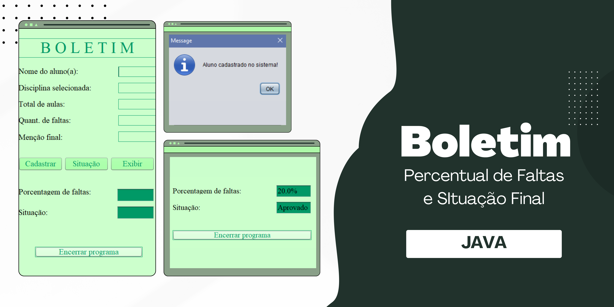

# Boletim

Projeto Java que calcula o percentual de faltas e compara com a nota, exibindo a situação final do aluno em questão.

## :thought_balloon: Visão Geral

Projeto simples utilizando Java para calcular a situação final de um aluno em determinada matéria.

## :rocket: Tecnologias Utilizadas

- Java
- Git e Github

## :speech_balloon: Instruções de Instalação

Instale o `Apache NetBeans` e o `Java` em seu computador. Com isso, faça o download do arquivo.

## :grey_question: Como Usar

Após a instalação e configuração, vá em `Open Project` dentro do NetBeans e abra o aequivo instalado.

## :grey_exclamation: Estrutura de Arquivos
├── SitAluno_OO_UI

├── Source Packages

├── default package

└── Aluno.java

└── SitAlunoForm.java

## :love_letter: Contribuição

Contribuições são sempre bem-vindas!

## :v: Créditos

Feito com muito ♥ by Julia Faria :wave: